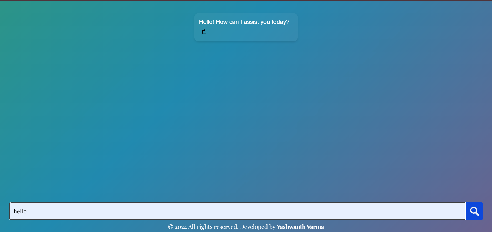

# CIPHER-CHAT (CHAT BOT)

This project is a Chat Bot powered by OpenAI's language model (gpt-3.5-turbo) that can provide responses to user queries. It is built using Node.js, Express, and various npm packages.
## How to Run the Application

Follow these steps to run the application locally:

1. **Clone the Repository:**
    ```bash
    git clone https://github.com/your-username/your-repo.git
    cd your-repo
    ```

2. **Install Dependencies:**
    ```bash
    npm install
    ```

3. **Set Up Environment Variables:**
    - Create a `.env` file in the root directory and add your OpenAI API key.
    ```bash
    echo "OPENAI_API_KEY=your-api-key-here" > .env
    ```

4. **Run the Application:**
    ```bash
    npm start
    ```

5. **Install npm Packages:**
    ```bash
    npm install dotenv express body-parser openai colors ejs nodemon
    ```


## Usage

1. Access the application in your browser at [http://localhost:3000](http://localhost:3000).
2. Start sending prompts to the chat bot.

## Features

- The application uses the OpenAI API to generate responses based on user input.
- The user interface allows you to interact with the chat bot easily.

## Additional Information

- The application includes a simple chat history that is stored in memory.
- The welcome messages and server status are displayed in the console.

## Screenshots

```bash
# Placeholder commands for adding screenshots


